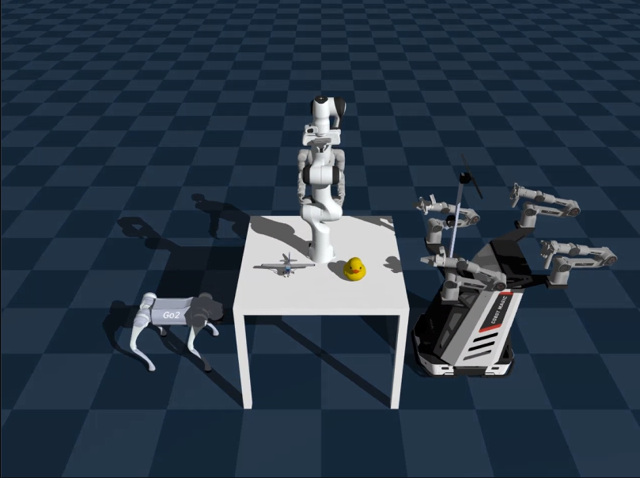
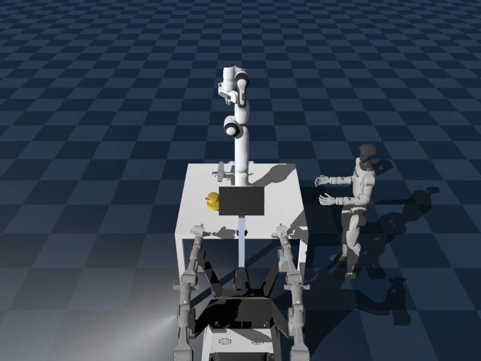
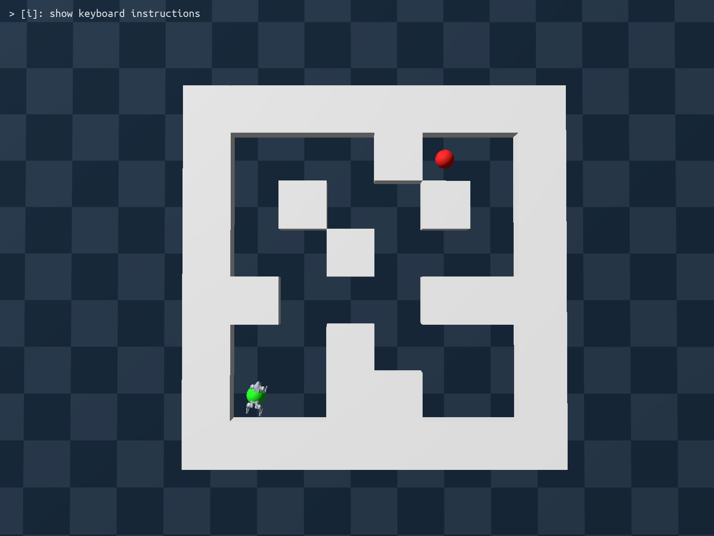

# Embodied AI 2025 Fall – HW2: Robotics Simulation Workflow

## Overview

This homework focuses on the **core workflow of modern robotics simulation**, including constructing virtual environments, placing robots and objects, integrating sensors, and controlling behaviors. This logic is fundamental to research in Embodied AI and Robot Learning.

-----

## Structure

  * **Part 1 – Hello World:** Build a basic simulation scene with multiple robots and objects.
  * **Part 2 – Sensors:** Attach perception modules like IMU, LiDAR, and Tactile sensors.
  * **Part 3 – Tasks:** Combine perception and control to achieve simple embodied tasks.

-----

## Environment Setup

We use **`uv`** for environment and dependency management.

To set up the environment, run:

```bash
uv sync
```

This command will create a virtual environment and install all necessary dependencies. Refer to the `uv` official documentation for additional setup details or troubleshooting.

### Frameworks and Tools

This assignment uses **Genesis**, a lightweight and modular robotics simulator. All parameters are managed through **Tyro**, which provides automatic Command Line Interface (CLI) interfaces from dataclasses.

You can inspect command-line options for any script by running:

```bash
uv run <script_path> --help
```

The workflow—scene definition, simulation stepping, sensor integration, and data visualization—mirrors the essential structure of modern simulation pipelines in embodied AI.

-----

## Part 1 – Hello World (35 pt)

### Objective

Construct a minimal but complete Genesis scene to familiarize yourself with the simulation process.




### Requirements

Complete all `# TODO` sections in `part1/hello_world.py`:

  * **Environment Setup:** Create a **table** composed of a tabletop and four legs, correctly positioned. (1 pt)
  * **Robots:** Load **Unitree Go2**, **Unitree G1**, **Aloha**, and **Franka** robots into the scene. All robots should face the table. (4 $\times$ 4 pt)
  * **Objects:** Place **`airplane.obj`** and **`duck.obj`** on the table surface, both oriented toward the positive x-axis. （2 $\times$ 2 pt)
  * **Camera:** Configure an orbiting camera to capture the **full scene**. (5 pt)
  * **Simulation Loop:** Implement a simple control or fixed-robot mode based on CLI arguments. (5 pt)
  * **Record:** Record a video demonstrating the scene. (5 pt)

### Deliverables
  * Completed Code: `part1/hello_world.py`
  * Output Video: `part1/hello_world.mp4`

### Hints

For robots assets, you should search on the internet. You can find these on their official website or github repo.

-----

## Part 2 – Sensors

### Objective

Understand how to integrate sensors and collect data from a simulated environment. This part involves attaching sensors to robots and visualizing their outputs.

### Requirements (20 pt)

#### 1\. IMU Sensor (Part 2.1)

  * Attach an **IMU** to the Franka arm’s end-effector. (2 pt)
  * Execute controlled motion and analyze its acceleration data.
  * Compare **noisy IMU measurements** with **ground-truth values** to understand sensor modeling and signal noise. (3 pt)

#### 2\. LiDAR Sensor (Part 2.2)

  * Simulate **maze navigation** with range sensors.
  * A mobile robot is placed at a start position (**S**) and must navigate to the goal (**G**) through a maze environment.
  * Attach both **LiDAR** and **Depth Camera** sensors to the robot to capture spatial information. (2 $\times$ 5 pt)
  * Construct the simulation, record sensor data, and visualize the results. (5 pt)
  * **Visualization Scripts (provided under `scripts/`):**
      * `depth_viz.py`: Generates a colored depth video from `depth_maze_data.npz`.
      * `lidar_viz.py`: Generates a 3D point cloud animation from `lidar_maze_data.npz`.

### Deliverables

| Part | Item | File |
| :--- | :--- | :--- |
| **2.1 (IMU)** | Completed Code | `part2/imu.py` |
| | Visualization Plot | `part2/imu_acceleration_plot.png` |
| **2.2 (LiDAR/Depth)** | Completed Code | `part2/lidar.py` |
| | Recorded Sensor Data | `part2/depth_maze_data.npz` |
| | Recorded Sensor Data | `part2/lidar_maze_data.npz` |
| | Depth Video Output | `part2/depth_viz.mp4` |
| | LiDAR Point Cloud Video Output | `part2/lidar_viz.mp4` |

-----

## Part 3 – Tasks (45 pt)

### Objective

Integrate simulation, perception, and control by training and evaluating a Go2 locomotion policy for a maze navigation task.



### Requirements

1.  Complete all **TODO** items in `part3/go2_env.py` and `part3/go2_train.py`.
      * Train a policy that accepts the command triplet $c=(v_x^c, v_y^c, \omega^c)$ (high-level command) and outputs actions for the robot. (10 pt)
2.  Implement the evaluation script `part3/go2_eval.py`:
      * Run the trained policy in simulation for **10 seconds per command**.
      * Test the following commands: $c_1=(1, 0, 0)$, $c_2=(0, 0.5, 0)$, $c_3=(0, 0, 1)$.
      * Record the actual linear and angular velocities of the robot.
      * For each command, plot three subplots comparing **commanded vs actual** $v_x, v_y, \omega$ over time. (5 pt)
      * Record a **top-down view video** for each command. (10 pt)
3.  Based on `Go2Env`, implement `Go2MazeEnv` in `part3/go2_maze_env.py` with the following maze layout:
      * Robot starts at **S** and must reach **G**.
      * Wall thickness: 1 m, corridor width: 1 m. (10 pt)

```
MAZE = [
"########",
"#OO#OOO#",
"#OO#O#G#",
"##OOOO##",
"###O#OO#",
"#OOOO#O#",
"#SO#OOO#",
"########",
]
```

1.  Use some method (e.g., waypoint tracking based on velocity integration or manual/keyboard control) to let the policy navigate from start **S** to goal **G**.
      * Record a **top-down video**. (5 pt)
      * Attach the **LiDAR/Depth sensors** from Part 2 and record depth and point cloud videos, similar to Part 2. (5 pt)

### Deliverables

| Category | Item | File |
| :--- | :--- | :--- |
| **Code** | Go2 Environment | `part3/go2_env.py` |
| | Training Script | `part3/go2_train.py` |
| | Evaluation Script | `part3/go2_eval.py` |
| | Maze Environment | `part3/go2_maze_env.py` |
| | Maze Run Script | `part3/go2_maze_run.py` |
| **Evaluation Plots** | Command $c_1$ Plot | `part3/eval_c1_plot.png` |
| | Command $c_2$ Plot | `part3/eval_c2_plot.png` |
| | Command $c_3$ Plot | `part3/eval_c3_plot.png` |
| **Evaluation Videos** | Command $c_1$ Top-down Video | `part3/eval_c1_topdown.mp4` |
| | Command $c_2$ Top-down Video | `part3/eval_c2_topdown.mp4` |
| | Command $c_3$ Top-down Video | `part3/eval_c3_topdown.mp4` |
| **Maze Demo** | Maze Top-down Video | `part3/maze_topdown.mp4` |
| | Maze Depth Data | `part3/maze_depth_data.npz` |
| | Maze Depth Visualization | `part3/maze_depth_vis.mp4` |
| | Maze LiDAR Data | `part3/maze_lidar_data.npz` |
| | Maze LiDAR Visualization | `part3/maze_lidar_vis.mp4` |

-----

## Notes

  * Each script must be **runnable with `uv run`** and configurable via the **Tyro CLI**.
  * Refer to the Genesis troubleshooting section in the course documentation for simulation instability or rendering issues.
  * Ensure all results are **reproducible** using provided parameters.